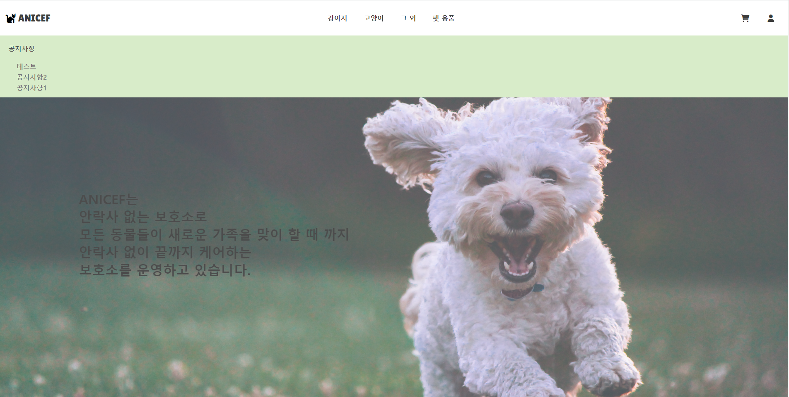
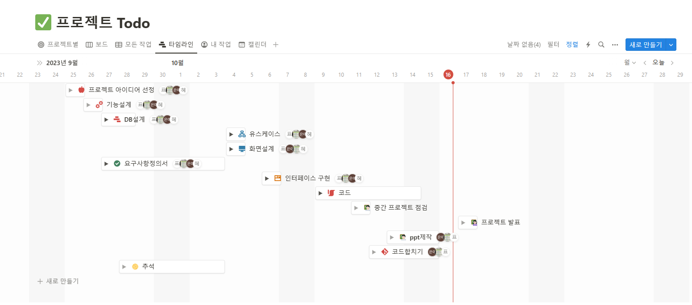

_# ANICEF 프로젝트

최종본

ANICEF 프로젝트 

최근 유기 동물이 많아져 사회문제로 여겨지고 있습니다. 

대부분의 사람들이 유기 동물을 입양하지 않는 이유로 꼽히는 것이 
깨끗하지 않을 것이라는 선입견과, 보호 센터의 접근성이라고 
생각합니다.

 관심 있는 모든 사람들이 자유롭게 열람하고 좀 더 쉽게
 접근할 수 있도록 도와주는 사이트입니다. 

<h2>사용된 개발환경 툴</h2>
<ul>
  <li>My sql</li>
  <li>Java</li>
  <li>Oracle RDBMS</li>
  <li>Tomcat 9.0</li>
  <li>HTML</li>
  <li>CSS</li>
  <li>JavaScript</li>
  <li>jQuery</li>
  <li>BootStrap 4</li>
</ul>

<h2>프로젝트 일정</h2>

<h2>팀원 소개</h2>
<ul>
  <li>표경희
    <ul>
      <li>https://github.com/KaengEE</li>
    </ul>
  </li>
    <li>조은이
      <ul>
        <li>https://github.com/joeuni-ex</li>
      </ul>
    </li>
    <li>배경태
      <ul>
        <li>https://github.com/realsingeriu</li>
      </ul>
  </li>
</ul>

</ul>

<h4><a href="https://drive.google.com/file/d/1CVOtdDQUvA9Ulaka5nCGQrNWKKjiJ76z/view?usp=sharing">:open_file_folder: 프레젠테이션 자료</a></h4>_
